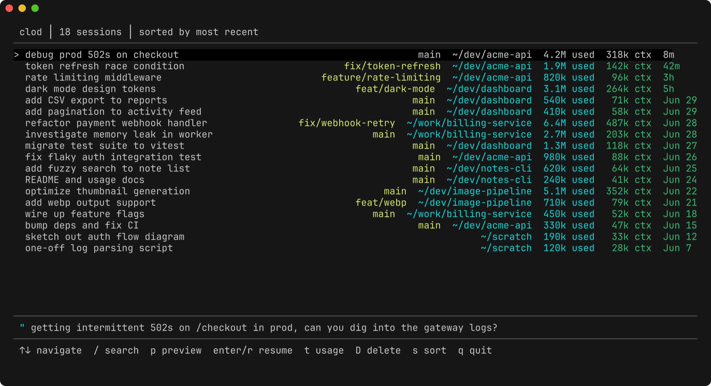
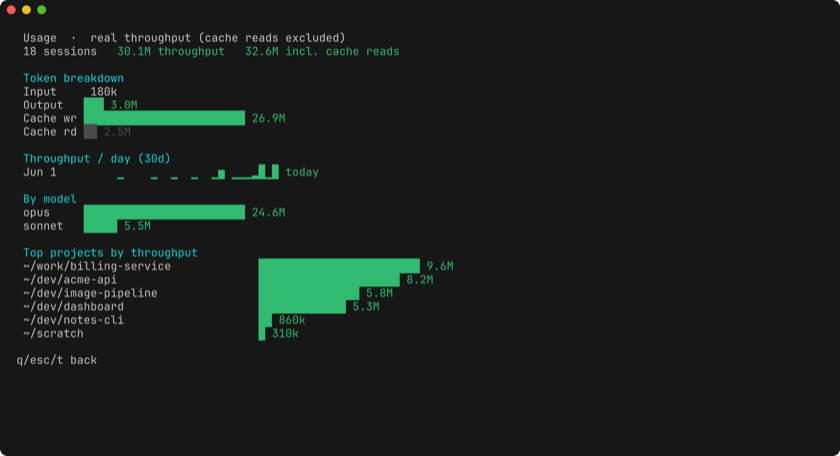

# clod

Terminal UI for managing Claude sessions.

Browse, search, preview, resume, and delete any session from any directory.



Like `claude -r` but better.

## Install

Not published to npm yet. Install from a clone:

```
git clone git@github.com:ungoldman/clod.git
cd clod
pnpm install
pnpm link --global .
```

This puts `clod` on your PATH, so you can run it from anywhere:

```
clod
```

Or skip the link step and run it in place from the clone:

```
node src/index.js
```

### Requirements

- Node 22+
- pnpm
- Claude Code CLI (`claude`) on PATH for resume

## Usage

### Keys

| Key | Action |
|-----|--------|
| `↑` / `↓` | Navigate list |
| `PgUp` / `PgDn` | Jump up/down a page |
| `/` | Search titles (fuzzy) and message contents |
| `space` | Preview conversation |
| `enter` | Resume selected session |
| `u` | Usage dashboard (token counts) |
| `s` | Cycle sort: recent → lexicographic → by directory |
| `D` | Delete (moves to Trash; includes tasks, file-history, session-env, debug/telemetry, and history.jsonl prompt lines) |
| `q` / `esc` | Quit |

### What it shows

Each row: session title · branch · project path · tokens used · context window · time since last activity

`used` is real throughput: tokens processed and generated (input + output +
cache writes), excluding cache reads. Cache reads re-count the same context
every turn and would inflate the figure ~10x, so they're left out. `ctx` is the
input context size of the session's most recent turn.

Times within today are relative (`now`, `5m`, `3h`); older sessions show a date.

Bottom bar: last user message from the selected session.

### Dashboard

Press `u` for an aggregate view across all sessions: total throughput, a token
breakdown by type (input / output / cache write / cache read), a 30-day
throughput-per-day sparkline, a per-model breakdown, and top projects by
throughput. The cache-inclusive grand total is shown alongside the headline so
you can see how much of the raw count is cache re-reads. All figures are real
recorded token counts, no estimation.



### How it works

Claude Code stores all session files in `~/.claude/projects/`, regardless of which directory the session was started in. `clod` reads from there directly. No home directory scanning.

### Maintenance

`scripts/cleanup.js` trashes orphaned session artifacts under `~/.claude`
(file-history, session-env, tasks, telemetry, and stale `history.jsonl` lines
for sessions with no transcript left). Dry-run by default; `--apply` to act.
Per-session delete already covers these, so this is only for backlog from
deletions made outside `clod`. Don't `--apply` mid-session — a just-started
session looks orphaned until its transcript flushes.

```
node scripts/cleanup.js          # preview
node scripts/cleanup.js --apply  # trash them
```
